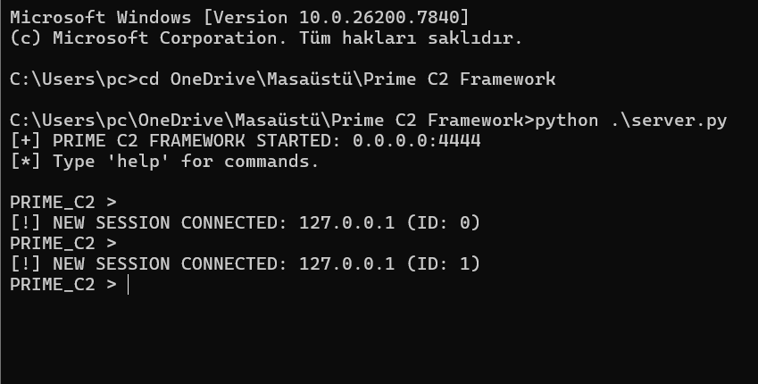

[README.md](https://github.com/user-attachments/files/25472709/README.md)
## PRIME C2 Framework

    

## ⚠️ LEGAL DISCLAIMER:
This project was developed strictly for educational and research purposes.
It demonstrates how Command & Control (C2) systems operate in controlled lab environments.
Do NOT use this software on systems or networks without explicit permission.
Unauthorized usage is illegal and unethical. The author assumes no responsibility for misuse.

## 📖 Overview

PRIME C2 is a Python-based Command & Control framework built as a cybersecurity research project.

The purpose of this framework is to understand how remote administration malware and C2 infrastructures work at a technical level. Instead of just studying theory, this project focuses on implementing core concepts such as encrypted communication, session management, persistence techniques, and basic surveillance capabilities.

This project is intended to help improve defensive awareness by understanding offensive techniques.

## 🏗️ System Architecture

The framework follows a traditional client-server C2 design:

## 🖥️ C2 Server (server.py)

Multi-threaded listener

Handles incoming agent connections

Manages active sessions

Sends encrypted commands to connected clients

## 🛰️ Agent (agent.py)

Runs on the target machine

Establishes a reverse connection to the server

Executes commands remotely

Supports keylogging and screen capture (for demonstration)

## ⚙️ Configuration (config.py)

Stores AES encryption key

Defines IP addresses and port settings

## 🔐 Cryptography Demo (crack_sim.py)

Standalone script simulating RSA key generation

Demonstrates how AES keys could be exchanged securely in real-world scenarios (conceptual model)

## ✨ Key Features

## 🔒 Encrypted Communication

End-to-end encryption using cryptography.fernet

TCP socket-based communication

Pre-shared AES key configuration

## 🎛️ Multi-Session Control

Supports multiple connected agents

Session switching from a central console

Backgrounding and interactive shell execution

## 🖱️ Surveillance Simulation

Keylogging using pynput

Screenshot capture using pyautogui

Remote shell command execution

## 🔁 Persistence & Reconnection

Automatic reconnect attempts

Optional Windows Startup persistence

Basic decoy behavior (opens a webpage on execution)

## ⚙️ Installation & Setup

1️⃣ Requirements

Python 3.x

Required libraries:

pip install -r requirements.txt

Dependencies:

cryptography

pynput

pyautogui

2️⃣ Configuration

Before running the framework, configure config.py:

AES_KEY = b'<YOUR_BASE64_32_BYTE_KEY>'
C2_IP = "192.168.X.X"
C2_PORT = 4444
BIND_IP = "0.0.0.0"

Make sure the IP address matches your testing environment.

3️⃣ Running the Framework

Start the C2 Server:

python server.py

Run the Agent:

python agent.py

(Optional) Build Windows executable:

pyinstaller --onefile --noconsole --name "SystemUpdate" agent.py

## 💻 Command Reference

Server Console Commands
Command	Description
list	Show connected agents
use <id>	Interact with a specific session
exit	Close all connections and stop the server
Session Commands
Command	Description
cd <path>	Change working directory
screenshot	Capture and download screen
get_keys	Retrieve logged keystrokes
live	Start live keylogger stream
back	Return to main console
any shell cmd	Execute OS-level commands

## 📸 Screenshots

### 🖥️ C2 Admin Console
Managing multiple active sessions and issuing encrypted commands.

### 🛰️ Remote Surveillance
Example of a successfully exfiltrated screenshot from a target machine.

### ⌨️ Keylogger Data
Retrieving captured keystrokes from the remote agent.

## 🛡️ Defensive Perspective

Understanding how this framework works helps defenders identify suspicious behavior.
Indicators include:
Frequent short-interval beaconing traffic
Unexpected executables in Windows Startup directory
Unsigned binaries using keyboard hooks (pynput)
Screen capture API usage from unknown processes
Suspicious outbound TCP connections
Modern EDR and IDS solutions can detect most of these behaviors through heuristic analysis.

## 👨‍💻 Author

Deniz Karaman
Computer Engineering Student
İzmir University of Economics
